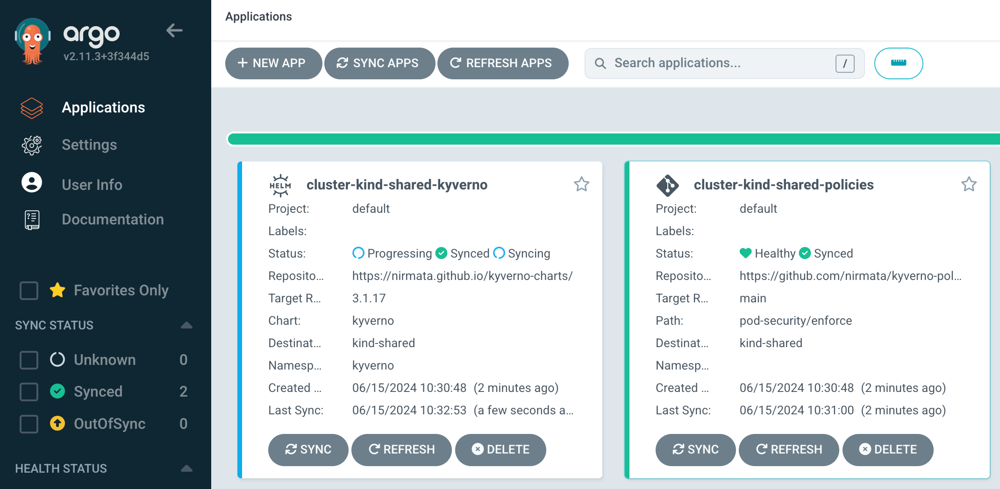

# Installing Enterprise Kyverno with GitOps

This guide deploys Enterprise Kyverno and policies using ArgoCD application sets.

The setup runs ArgoCD on its own `hub` cluster and creates namespaces and applications on a `shared` cluster. 

For the PoV, we will use `kind` clusters.


## Installation

### 1. Install [kind](https://kind.sigs.k8s.io/) and create a cluster for ArgoCD:

```sh
kind create cluster --name argocd
```

### 2. Install and configure ArgoCD

**Install ArgoCD**

```sh
kubectl create namespace argocd
kubectl apply -n argocd -f https://raw.githubusercontent.com/argoproj/argo-cd/stable/manifests/install.yaml
```

```sh
kubectl patch svc argocd-server -n argocd -p '{"spec": {"type": "LoadBalancer"}}'
```

```sh
kubectl -n argocd get secret argocd-initial-admin-secret -o jsonpath="{.data.password}" | base64 -d; echo
```
>NOTE: It might take a few seconds for `argocd-initial-admin-secret` to be created.

```sh
kubectl port-forward svc/argocd-server -n argocd 8080:443
```

Navigate to: https://127.0.0.1:8080/

Install the [argocd CLI](https://argo-cd.readthedocs.io/en/stable/cli_installation/) and login:

```sh
argocd login localhost:8080 --username admin --password <SECRET>
```

**Install ArgoCD ApplicationSet resources for Enterprise Kyverno and Kyverno policies**

```sh
kubectl apply -f argocd/config/argocd-cluster/appsets/
```

- The [Kyverno ApplicationSet](./config/argocd-cluster/appsets/kyverno.yaml) tracks a Helm chart.

- The [Kyverno policies ApplicationSet](./config/argocd-cluster/appsets/kyverno-policies.yaml) tracks a Git repository with kustomize.

### 3. Create and register a shared cluster

To allow ArgoCD on the `argocd` cluster to communicate with the `shared` cluster, the `shared` cluster needs to be configured to use an external IP address i.e. your local machine address.

Run this script to create a kind configuration:

```sh
./argocd/config/shared-cluster/kind/create.sh
```

Create the kind cluster:

```sh
kind create cluster --name shared --config /tmp/kind-config.yaml
```

Register the kind cluster with ArgoCD:

```sh
argocd cluster add kind-shared -y
```

### 4. Check the shared cluster for Enterprise Kyverno and policies

ArgoCD will automatically deploy Enterprise Kyverno and the configured policies:



Wait for the `Status` of both applications `cluster-kind-shared-kyverno` and `cluster-kind-shared-policies` to show `Synced`

Switch context:

```sh
kind export kubeconfig --name=shared
```

Display policies:

```sh
kubectl get cpol -A
```

This should show:

```sh
kubectl get cpol -A
NAME                             ADMISSION   BACKGROUND   READY   AGE   MESSAGE
disallow-capabilities            true        true         True    8s    Ready
disallow-capabilities-strict     true        true         True    8s    Ready
disallow-host-namespaces         true        true         True    8s    Ready
disallow-host-path               true        true         True    8s    Ready
disallow-host-ports              true        true         True    8s    Ready
disallow-host-process            true        true         True    8s    Ready
disallow-privilege-escalation    true        true         True    8s    Ready
disallow-privileged-containers   true        true         True    8s    Ready
disallow-proc-mount              true        true         True    8s    Ready
disallow-selinux                 true        true         True    8s    Ready
require-run-as-non-root-user     true        true         True    8s    Ready
require-run-as-nonroot           true        true         True    8s    Ready
restrict-apparmor-profiles       true        true         True    8s    Ready
restrict-seccomp                 true        true         True    8s    Ready
restrict-seccomp-strict          true        true         True    8s    Ready
restrict-sysctls                 true        true         True    8s    Ready
restrict-volume-types            true        true         True    8s    Ready
```

**NOTE**: If the policies do not show `READY: true,` then Kyverno installation may not have completed correctly.

### 4. Create an insecure application on the shared cluster

Try creating an insecure pod:

```sh
kubectl run bad-pod --image=busybox:1.28 --dry-run=server
```

This should be blocked:

```sh
Error from server: admission webhook "validate.kyverno.svc-fail" denied the request:

resource Pod/default/bad-pod was blocked due to the following policies

disallow-capabilities-strict:
  require-drop-all: 'validation failure: Containers must drop `ALL` capabilities.'
disallow-privilege-escalation:
  privilege-escalation: 'validation error: Privilege escalation is disallowed. rule
    privilege-escalation failed at path /spec/containers/0/securityContext/'
require-run-as-nonroot:
  run-as-non-root: 'validation error: Running the container as root is not allowed.
    rule run-as-non-root[0] failed at path /spec/securityContext/runAsNonRoot/ rule
    run-as-non-root[1] failed at path /spec/containers/0/securityContext/'
restrict-seccomp-strict:
  check-seccomp-strict: 'validation error: Use of custom Seccomp profiles is disallowed.
    rule check-seccomp-strict[0] failed at path /spec/securityContext/seccompProfile/
    rule check-seccomp-strict[1] failed at path /spec/containers/0/securityContext/'
```

### 5. Create a secure application on the shared cluster

Try creating a secure pod:

```sh
kubectl apply -f argocd/config/sample-apps/good-pod.yaml --dry-run=server
```

This pod should be allowed as it complies with the `Restricted` profile of the Pod Security Standards.

## Cleanup

To clean up, delete the two kind clusters:

```sh
kind delete cluster --name shared
kind delete cluster --name argocd
```

## What's Next
In this guide we set up Kyverno and enforced the [Kubernetes Pod Security Standards](https://kubernetes.io/docs/concepts/security/pod-security-standards/). Here are some other policies and use cases that you can explore and implement:
* Implement [RBAC Best Practices](https://github.com/nirmata/kyverno-policies/tree/main/rbac-best-practices)
* Implement [Workload Security Best Practices](https://github.com/nirmata/kyverno-policies/tree/main/best-practices)
* Explore [Essential policies to implement in your Kubernetes Cluster](https://nirmata.com/2024/12/03/5-essential-policies-to-implement-in-your-kubernetes-cluster-with-kyverno/)
